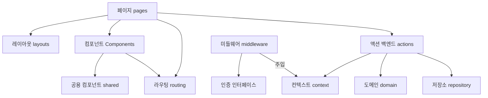

# 프로젝트 아키텍처 구조

```text
├── docs "문서들"
├── e2e 전구간 테스트
│   ├── sospeso.spec.ts
│   └── ...
├── migrations 마이그레이션들
│   ├── 0000_create_better_auth_user.sql
│   └── ...
├── src
│   ├── sospeso  순수한 도메인 로직
│   ├── adapters 외부 의존성 구현체와 인터페이스
│   ├── actions 아스트로 액션 (api)
│   │   ├── fixtures.ts 테스트 데이터
│   │   ├── index.test.ts 통합 테스트
│   │   └── index.ts 액션 정의
│   ├── middleware 인증 등의 미들웨어
│   ├── layouts 레이아웃 (document, head 등)
│   ├── routing 루트 정의와 href, Link 등의 라우터 라이브러리
│   ├── pages 프론트 페이지 루트 정의
│   ├── components 리액트 컴포넌트들
│   ├── event 타입 안전한 custom event dispatcher와 핸들러
│   ├── index.css 공통 스타일
│   ├── env.d.ts 전역 타입 설정
│   ├── lib 여기에 파일을 넣어야 한다는 better-auth를 위해
│   ├── shared 공용 UI 컴포넌트
│   ├── siheom 시험 테스트 라이브러리
│   └── stories 스토리북 스토리들
├── LICENSE
├── README.md
├── package.json
├── ... 수 많은 설정 파일들
```



## 컴포넌트 components

각 페이지의 실질적인 로직을 담당하는 React 컴포넌트들입니다.

컴포넌트마다 test와 함께, stories 폴더에는 스토리북을 만들어서 다양한 경우의 수를 테스트합니다.

컴포넌트에서는 api 등의 외부 상태 등에 대한 의존성은 없어야 합니다. 내부의 상태나 로직은 들고 있을 수 있어야 합니다.

form 등으로 mutation을 일으킬 때에는 schema와 `event`를 정의하고 astro `pages`로 커스텀 이벤트를 버블링해서 올려주는 것만 테스트합니다.

## 공용 컴포넌트 Shared

Form이나 Pagination 등의 디자인 시스템 등 여러 도메인의 페이지를 가로질러서 나오는 UI 컴포넌트들이 있습니다.

따라서 shared의 컴포넌트들은 특정 도메인의 지식을 몰라야 합니다.

## 라우팅 routing

다양한 곳에서 쓰이는 route를 정의하고 진실의 원천으로 삼는 곳 입니다. 새 페이지를 추가할 때마다 routes 를 추가해줘야 합니다.

navigate나 link, redirect 등에서 url을 하드코딩해서는 안 되고 routing이 제공하는 타입 안전한 함수와 컴포넌트들을 사용해야 합니다.

## 페이지 pages

pages는 의존성들이 한 곳에 모이는 곳입니다.

- routing에서 정의한 대로 파일 디렉토리 기반 라우팅을 합니다. params 등을 파싱해서 내려줍니다.
- actions로 서버 상태를 query해서 components 로 내려줍니다.
- components의 form에서 올라온 event를 받아서 서버의 actions 로 보냅니다.

## 액션 actions

백엔드 API에 해당하는 레이어로 Astro가 제공하는 RPC입니다.

zod schema로 input을 검증하고, repository와 domain에게 로직을 수행하게 합니다. 전통적인 아키텍처로 치면 web controller와 service 를 합쳐놓은 곳입니다.

action test에서는 실제 구현체에 가깝게 통합 테스트를 돌리면서 서로 다른 의존성 간의 연결이 잘 되었는지를 확인합니다.

복잡하고 다양한 경우의 수와 핵심 정책들은 domain에서 처리해야 합니다.

## 도메인 domain (sospeso, auth ...)

순수 함수와 타입으로 도메인의 명사와 동사, 제약 조건들을 모델링합니다. 보통 sospeso 처럼 도메인의 이름을 가진 폴더 안에 있습니다.

도메인 모델은 모든 로직의 진실의 원천입니다. domain 모델은 DB 등에 의존해서는 안 되고, 순수 typescript로만 설계합니다. 

## 레포지토리 repository

데이터를 영속하는 책임을 가진 구현체입니다. 

DB 중심이 아니라 domain 중심으로 개발하기 위해서는, repository에 이런저런 비즈니스 로직이 들어가면 안 됩니다.

fake repository 는 메모리에 떠있는 변수일 뿐으로, 빠르게 개발하고 테스트하고 DB의 관심사를 분리하기 위해 사용합니다.

실제 DB repository 구현체는 현재 drizzle orm과 Turso SQLite 데이터베이스로 구현되어 있습니다. action test에서는 다양한 구현체를 갈아끼워서 테스트할 수 있게 되어 있지만, 프로덕션 DB를 바라보지는 않습니다.

프로덕션 DB는 실제로 배포된 앱을 대상으로 playwright를 이용해 E2E 테스트만 해야 합니다.

## 어댑터 adapters

통제 하기 어려운 의존성을 우리의 인터페이스를 정의해서 감싸놓은 인터페이스입니다.

- dateApi나 IdGenerator처럼 통제하기 어려운 시간이나 무작위 랜덤 같은 의존성들
- clipboardApi 브라우저 등의 권한이나 인증에 의존하는 의존성들
- emailApi나 authApi 처럼 통제할 수 없는 외부 서비스를 이용해서 구현한 의존성들

등이 있습니다. 이러한 외부 의존성은 암암리에 들어와서는 안 되며 인터페이스로 감싸고, 어댑터로 구현해야 합니다. 테스트에서는 같은 인터페이스를 구현한 가짜 구현체를 쓸 수 있습니다.
