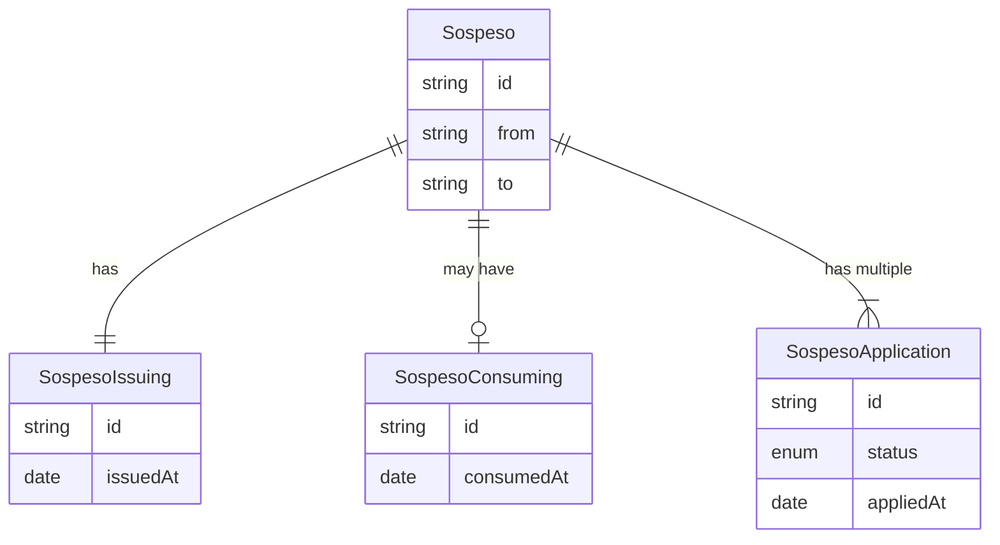
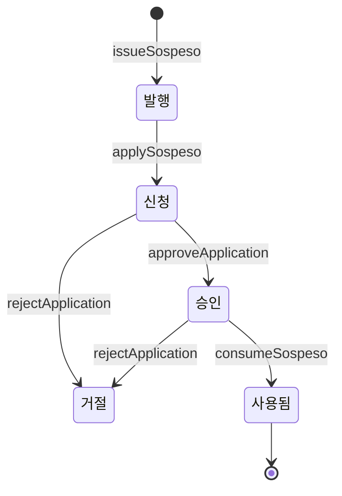

## 명사들

### Sospeso 소스페소
코칭을 받을 수 있는 쿠폰입니다. 도메인 주도 설계 식으로 말하자면 [aggregate root](https://velog.io/@gentledot/ddd-aggregate)입니다.

발행 -> 신청 -> 승인 혹은 거절 -> 사용됨 으로 이어지는 생명주기를 거칩니다.

### SospesoIssuing 소스페소 발행

발행자가 소스페소를 발행한 기록입니다. 발행한 적이 없는 소스페소는 없기 때문에 필수 값이고, 소스페소마다 딱 하나만 있는 1:1 관계입니다.

### SospesoApplication 소스페소 신청

수혜자가 소스페소로 코칭을 받고 싶다는 신청한 상태입니다. 신청된 소스페소는 승인하거나 거절할 수 있습니다. 이미 승인한 소스페소도 코칭이 취소된다면 다시 거절될 수 있습니다.

소스페소를 누군가 소스페소를 신청하거나 승인한 상태에서는, 추가로 신청을 받지 않습니다. 기존의 소스페소 신청이 거절되면 새롭게 신청을 받을 수 있습니다. 다시 말해 하나의 소스페소에 여러 신청이 있을 수 있습니다.

### SospesoConsuming 소스페소 사용

소스페소가 사용된 기록입니다. 소스페소가 사용되면 이 소스페소의 생명주기가 끝납니다.